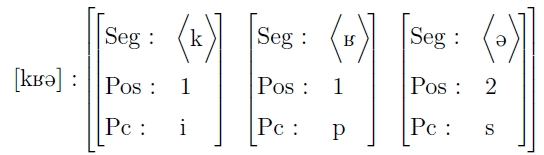
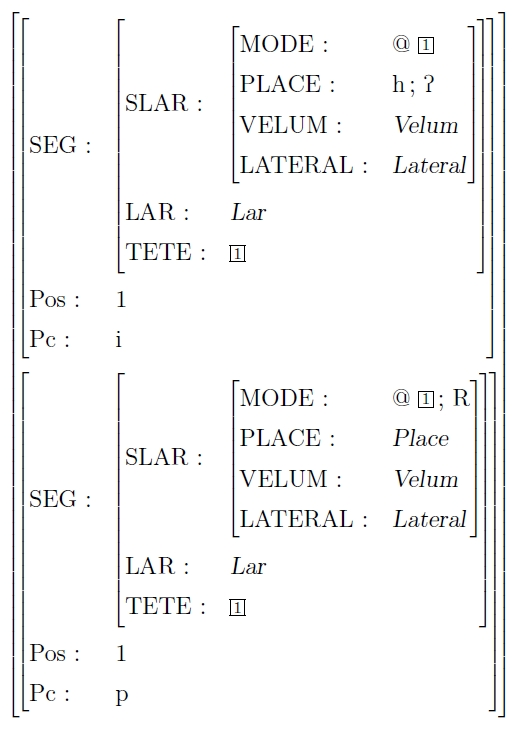

Ce package permet de réaliser des structures de traits, de la plus simple à la plus complexe.

Pour télécharger ce paquet et en avoir une démonstration plus poussée, rendez-vous sur [cette page](http://www.essex.ac.uk/linguistics/external/clmt/latex4ling/avms/) du site consacré à l'utilisation de LaTeX en Sciences du langage. Avant tout essai, penser bien à charger le package avec la commande

```bash
\usepackage{avm}
```

Notez que les exemples présentés ici nécessitent la présence du package tipa dont nous parlons [ici](../tipa_vowel).

En voici un exemple basique&nbsp;:



En voici un exemple un peu plus « imposant »&nbsp;:



Voici un ECM (exemple complet minimal, « concept » provenant de [fr.comp.text.tex](http://groups.google.fr/group/fr.comp.text.tex/topics)) de l'utilisation du package avm (nécessitant cependant le package tipa)
[téléchargeable ici](avm.tex) ; les deux premières structures proviennent d'un dosier de phonologie que j'ai réalisé, la troisième vient de la documentation mentionnée précédemment&nbsp;:

```latex
\documentclass[a4paper,10pt]{article}
\usepackage[utf8x]{inputenc}
\usepackage{avm}
\usepackage{tipa}
 
\begin{document}
 
\begin{avm}\textipa{[kK@]} :
\[ \[ Seg : & \&lt;\textipa{k}\&gt; \cr
 Pos : & 1 \cr
 Pc : & i \]
& \[ Seg : & \&lt;\textipa{K}\&gt; \cr
 Pos : & 1 \cr
 Pc : & p \]
& \[ Seg : & \&lt;\textipa{@}\&gt; \cr
 Pos : & 2 \cr
 Pc : & s \] \]
\end{avm}
 
\vspace{2cm}
 
\begin{avm}
\[
\[ SEG : & \[ SLAR : & \[ MODE : & @ \@1 \cr
 PLACE : & h ; \textglotstop \cr
 VELUM : & \textsl{Velum} \cr
 LATERAL: & \textsl{Lateral} \cr
 \] \cr
 LAR : & \textsl{Lar} \cr
 TETE : & \@1 \] \cr
 Pos : & 1 \cr
 Pc : & i
 \] \cr
\[ SEG : & \[ SLAR : & \[ MODE : & @ \@1 ; R \cr
 PLACE : & \textsl{Place} \cr
 VELUM : & \textsl{Velum} \cr
 LATERAL: & \textsl{Lateral} \cr
 \] \cr
 LAR : & \textsl{Lar} \cr
 TETE : & \@1 \] \cr
 Pos : & 1 \cr
 Pc : & p \] \]
\end{avm}
 
\newpage
 
\newbox\matrixsynsem \newbox\headdtr
\newbox\compdtrone \newbox\compdtrtwo
 
{\scriptsize
\avmoptions{center}
\setbox\matrixsynsem=\hbox{\begin{avm}
\osort{synsem}{\[local & \[cat & \[ \] \\
 content & \[ \]\]\]}
\end{avm}}
 
\setbox\headdtr=\hbox{\begin{avm}
\osort{word}{\[ phon\;\&lt;\rm likes\&gt;\\
 synsem\;\[local\[ cat\;\[ head \; \@{5}\\
 arg-s\;\&lt; \@{1},\@{2}\&gt;\] \\
 content\;\@{6} \]\]\]} \end{avm}}
 
\setbox\compdtrone=\hbox{\begin{avm}
\sort{phrase}{\[ phon\;\&lt;\rm fido\&gt;\\
 synsem\;\@{1}\;\[local\[ cat\;\[ head\;noun\\
 arg-s\;\&lt; \&gt;\] \\
 content\;\@{3} \]\]\]} \end{avm}}
 
\setbox\compdtrtwo=\hbox{\begin{avm}
\sort{phrase}{\[ phon\;\&lt;\rm bones\&gt;\\
 synsem\;\@{2}\;\[local\[ cat\;\[ head\;noun\\
 arg-s\;\&lt; \&gt;\] \\
 content\;\@{4} \]\]\]} \end{avm}}
 
\avmoptions{active,sorted}
\begin{avm} \hspace{-1in}
[{phrase} phon\;\&lt;\rm fido likes bones\&gt; \\
 synsem\;[{synsem} local [{} cat & [{} head & @{5}\\
 arg-s & \&lt; \; \&gt;] \\
 content & @{6}[{psoa} reln\;like \\
 arg1\;@{3} \\
 arg2\;@{4} ]]]\\
 dtrs\;\sort{head-struc}{[{} head-dtr\;\box\headdtr \\
 comp-dtrs\;&lt; \box\compdtrone , \\ \hspace{.5in}
 \box\compdtrtwo&gt;]}]
\end{avm}}
 
\end{document}
```