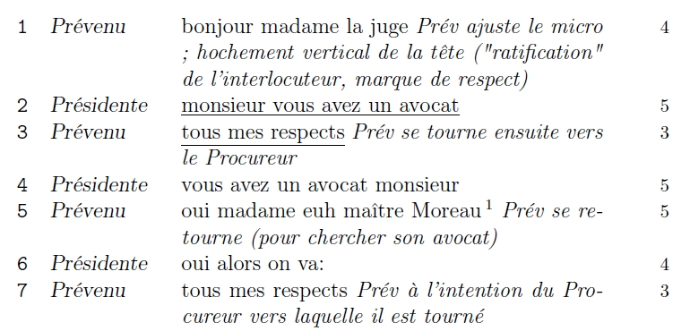

Pour mon mémoire de Master Recherche Sciences du langage, il me fallait, à partir d'une transcription, faire une analyse du capital verbal, ce qui impliquait compter les mots de chaque intervention. N'étant plus à convaincre de la puissance de LaTeX, je me suis dit que ce devait être possible d'automatiser une telle tâche.

Après quelques recherches infructueuses, je poste sur le groupe francophone de discussions dédié à TeX et LaTeX (voir la discussion [ici](http://groups.google.fr/group/fr.comp.text.tex/browse_thread/thread/13a0ae96039c63b1/e6e97d7f9d1e38d7)) et très rapidement mpg ([Manuel Pégourié-Gonnard](https://elzevir.fr/)) prend les choses en main et très vite propose le code pour faire ce qui va bien.

Fonctionnement grossier : on calcule pour chaque ligne (sauf celle qui ne commence pas par un numéro) le nombre de mots de la troisième colonne du tableau (en éliminant le texte apparaissant en italique [\emph{}] ainsi que les mots en capitales) puis on remplit la quatrième colonne. Voici ce que cela donne :



Vous trouverez ci-dessous le code fourni par mpg et [là](test_decompte.tex) le fichier comprenant le code de mpg ainsi que la transcription du corpus ; n'attendez pas de moi que je vous explique comment cela fonctionne...

```latex
\makeatletter
 
% Registres, booléens et marqueurs.
 
\newtoks\PT@table   % le corps du tableau
\newtoks\PT@data    % les données : nb de mots par ligne + locuteur
\newif\ifPT@four@   % ajouter une quatrième colonne ?
\newcount\PT@count  % pour les stats
\newcommand\EndProcessTable{%
  \PT@EndProcessTable}
 
% Manipulation des registres.
 
\newcommand\PT@table@add[1]{% 
  \PT@table\expandafter{\the\PT@table#1}}
 
\newcommand\PT@data@add[1]{%
  \PT@data\expandafter{\the\PT@data#1}}
 
% Décompte des mots (via les espaces) à proprement parler.
 
\edef\PT@twospaces{\space\space}  % deux lexèmes espace
 
\shorthandon{;:?!} % pour avoir les même \catcode que dans le document
\newcommand\PT@count@words{%
  % on commence par éliminer les trucs qui font foirer la supposition
  % de base que (nb mots = nb espaces + 1)...
  \Substitute*[\def\PT@temp]{\PT@temp}{ ;}{}%
  \Substitute*[\def\PT@temp]{\PT@temp}{ :}{}%
  \Substitute*[\def\PT@temp]{\PT@temp}{ ?}{}%
  \Substitute*[\def\PT@temp]{\PT@temp}{ !}{}%
  % la ligne suivante compte les espaces restants
  \Substitute*{\PT@temp}{ }{}%
  \advance\ted@count\@ne} % mots = espaces + 1
\shorthandoff{;:?!} % plus besoin des \catcode spéciaux
 
% La macro précedente suppose qu'il n'y a d'espace ni au début ni à la fin :
% c'est potentiellement faux, il faut donc s'en assurer auparavant.
 
\newcommand\PT@strip@spaces{% % prépare le terrain pour \PT@strip@
  \expandafter\expandafter\expandafter\PT@strip
  \expandafter\PT@temp\expandafter\@nil\space\@nil\@nill}
 
\newcommand\PT@strip[1]{% % enlève les éventuels espaces initiaux
  \PT@strip@#1}
 
\@ifdefinable\PT@strip@\relax
\def\PT@strip@#1 \@nil#2\@nill{% % enlève les éventuels espaces finaux
  \ifx#2\empty\empty
    \PT@strip@@#1%
  \else
    \def\PT@temp{#1}%
  \fi}
 
\@ifdefinable\PT@strip@@\relax
\def\PT@strip@@#1\@nil{%
  \def\PT@temp{#1}}
 
% Nettoyage : on enlève les commandes de « commentaires » et leurs arguments.
% Utilise un \xdef protégé, ce qui suppose que tout est robuste...
 
% nettoyage proprement dit
\newcommand*\PT@cleanup[1]{%
  \begingroup \PT@do@comments
  \protected@xdef\PT@temp{#1}%
  \endgroup
  % on pourrait avoir 2 espaces de suite suite à supression de commande
  \Substitute**[\def\PT@temp]{\PT@temp}{\PT@twospaces}{\empty}% 
  \PT@strip@spaces}
 
% initialisation (cf plus bas pour les réglages)
\newcommand\PT@do@comments{}
 
% Boucle de traitement principale. 
 
\newcommand\ProcessTable{%
  \PT@table{}%
  \PT@data{}%
  \PT@cell@one}
 
% traitement de la première cellule : il y a pas mal de cas à détecter
\newcommand\PT@cell@one[1]{%
  \let\PT@next\PT@nextline
  \ifcat\noexpand#1\relax % détecte les séquences de contrôle
    \ifx#1\EndProcessTable % regarde si on a fini
      \let\PT@next\PT@finish
    \else
      \PT@if@interline{#1}{\let\PT@next\PT@gobble@interln}%
    \fi
  \else
    \ifnum`#1&lt;58 % truc moche pour voir si #1 est un chiffre
      \ifnum`#1&gt;47
        \let\PT@next\PT@cell@one@
      \fi
    \fi
  \fi
  \PT@next#1}
 
% détection des inter-lignes comme \midrule (liste dans \PT@interliners)
\newcommand\PT@if@interline[2]{% % pour l'instant
  \def\PT@temp##1#1##2\@nil{%
    \ifx\empty##2\empty \else #2\fi}%
  \expandafter\PT@temp\PT@interliners#1\@nil}
 
% initialisation (réglage voir plus bas)
\newcommand\PT@interliners{}
 
% traitement des inter-lignes
\newcommand\PT@gobble@interln[1]{%
  \PT@table@add{#1}%
  \PT@cell@one}
 
% lignes ne commençant pas par un chiffre : on passe
\def\PT@nextline#1\tabularnewline{%
  \PT@table@add{#1\tabularnewline}%
  \PT@cell@one}
 
% lignes à traiter, cellule par cellule
\def\PT@cell@one@#1&{% 
  \PT@table@add{#1&}%
  \PT@data@add{\PT@line{#1}}%
  \PT@cell@two}
 
% cellule deux : on assainit les espaces avant d'enregistrer le nom
\def\PT@cell@two#1&{%
  \PT@table@add{#1&}%
  \def\PT@temp{#1}\PT@strip@spaces
  \expandafter\PT@data@add\expandafter{\expandafter{\PT@temp}}%
  \PT@cell@three}
 
% traitement de la dernière cellule et bouclage
\def\PT@cell@three#1\tabularnewline{%
  \PT@table@add{#1}%
  \PT@cleanup{#1}\PT@count@words
  \expandafter\PT@data@add\expandafter{\expandafter{\the\ted@count}}%
  \ifPT@four@
    \expandafter\PT@table@add\expandafter{\expandafter&\the\ted@count}%
  \fi
  \PT@table@add{\tabularnewline}%
  \PT@cell@one}
 
% en fin de boucle, avaler le délimiteur de fin
\def\PT@finish\EndProcessTable{}
 
% Récupération des données par l'utilisateur.
 
% composer le tableau obtenu
\newcommand\PrintTable{%
  \def\PT@next{\begin{TableEnv}}%
    \expandafter\PT@next\the\PT@table
  \end{TableEnv}}
 
% macro utilisateur : ajuste les bornes (< \to \leq) avant tout
\newcommand\GetStats[2]{%
  \edef\PT@temp{\noexpand\PT@get@stats{%
      \number\numexpr#1-1\relax}{\number\numexpr#2+1\relax}}%
  \PT@temp}
 
% chope vraiment les stats
\newcommand\PT@get@stats[3]{%
  \def\PT@name{#3}%
  \PT@count\z@
  \let\PT@line\PT@line@check
  \def\PT@line@##1##2##3{%
    \ifnum##1&gt;#1
      \ifnum##1&lt;#2
        \def\PT@temp{##2}%
        \ifx\PT@temp\PT@name
          \advance\PT@count##3\relax
        \fi
      \fi
    \fi}%
  \the\PT@data
  \the\PT@count}
 
% faire gaffe aux éventuels numéros comme 30b
\newcommand\PT@line@check[1]{%
  \PT@line@checkb#1b\@nil}
 
\def\PT@line@checkb#1b#2\@nil{%
  \PT@line@{#1}}
 
% Macros de gestion pour l'utilisateur
 
% ajout de « commentaires »
\newcommand*\PTAddComment[2]{%
  \ifcase#2
    \g@addto@macro\PT@do@comments{\let#1\empty}%
  \or
    \g@addto@macro\PT@do@comments{\let#1\@gobble}%
  \or
    \g@addto@macro\PT@do@comments{\let#1\@gobbletwo}%
  \or
    \g@addto@macro\PT@do@comments{\let#1\@gobblethree}%
  \or
    \g@addto@macro\PT@do@comments{\let#1\@gobblefour}%
  \fi}
 
% choix du traitement
\newcommand\PTNoFourthColumn{%
  \def\PTColumns{3}\PT@four@false}
\newcommand\PTFourthColumn{%
  \def\PTColumns{4}\PT@four@true}
\PTFourthColumn % par défaut
 
% ajout de macros inter-lignes
\newcommand*\PTAddInterLiners{%
  \g@addto@macro\PT@interliners}
 
\makeatother
 
% 
% Partie utilisateur. Son job consiste à :
% - définir l'environnement TableEnv pour le tableau final ;
% - signaler ses macros de « commentaires » à ignorer ;
% - s'assurer que ses autres macros soient robustes ou protégées ;
% - signaler les trucs entre les lignes (\midrule, etc) ;
% - choisir si une quatrième colonne est ajoutée (oui par défaut).
% 
 
\newlength\coli \newlength\colii \newlength\coliii
\settowidth\coli{\ttfamily 000b}
\settowidth\colii{\slshape (Procureur)}
\setlength\coliii{\textwidth - 2\coli - \colii - 3\arraycolsep - 33pt}
 
\newcolumntype{y}{&gt;{\ttfamily\raggedleft}p{\coli}}
\newcolumntype{x}{&gt;{\slshape}p{\colii}}
\newcolumntype{z}{&gt;{\rmfamily\footnotesize\raggedleft}m{\coli}}
 
% c'est là-dedans que sera composé le tableau une fois traité
\newenvironment{TableEnv}{% 
  \par\noindent
  \begin{longtable}{yxp{\coliii}z}%
    }{%
  \end{longtable}}
 
% doit être cohérent avec le choix ci-dessous...
% \PTNoFourthColumn
 
\newcommand\comm{\MakeUppercase}
 
% les commandes dont le contenu est à ignorer, et leur nb d'arguments
\PTAddComment{\emph}{1}
\PTAddComment{\comm}{1}
\PTAddComment{\footnote}{1}
\PTAddComment{\footnotemark}{1}
% nécéssite fixltx2e
\MakeRobust\underline
 
% trucs entre les lignes
\PTAddInterLiners{\toprule\midrule\bottomrule}
```