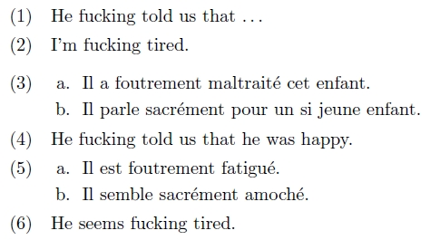
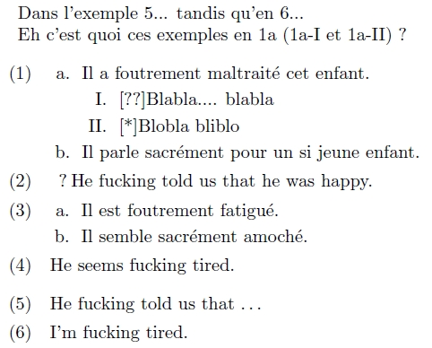

Le _[package gb4e](gb4e.zip)_ permet de présenter les exemples sous forme de listes ordonnées à la gestion fine, la possibilité d'indiquer un «&#8239;jugement&#8239;» et celle d'utiliser les commandes _\label_ et _\ref_.

===

Pour la gestion des exemples sous LaTeX, consulter [cette page](http://www.essex.ac.uk/linguistics/external/clmt/latex4ling/examples/) du site LaTeX4Ling (ils présentent, outre gb4e, l'extension covington).

Nous allons voir ici l'utilisation basique de ce package&nbsp;; pour plus détails, consulter la documentation présente dans l'archive.

Voici un exemple basique&nbsp;:

```latex
\begin{exe}
  \ex\label{adjv} He fucking told us that \ldots
  \ex\label{adja} I'm fucking tired.
\end{exe}
  
\begin{exe}
\ex
  \begin{xlist}
    \ex Il a foutrement maltraité cet enfant.
    \ex Il parle sacrément pour un si jeune enfant.
  \end{xlist}
\ex He fucking told us that he was happy.
\ex
  \begin{xlist}
    \ex Il est foutrement fatigué.
    \ex Il semble sacrément amoché.
  \end{xlist}
\ex He seems fucking tired.
\end{exe}
```



Il est possible de sélectionner la numérotation des listes apparaissant dans l'environnement xlist, en rajoutant au nom de l'environnement le symbole que l'on souhaite parmi ceux-ci : a (alphabétique), A (Alphabétique), i (romain), I (Romain), n (numérique). De plus il est possible d'ajouter des « jugements » ainsi que des renvois grâce aux commandes \label et \ref. Voici un exemple&nbsp;:

```latex
Dans l'exemple \ref{adjv}... tandis qu'en \ref{adja}...
Eh c'est quoi ces exemples en \ref{wtf} (\ref{wtf1}
et \ref{wtf2}) ?
  
\begin{exe}
\ex\label{fradv} 
  \begin{xlista}
    \ex Il a foutrement maltraité cet enfant.
      \begin{xlistI}\label{wtf}
       \ex\label{wtf1}[??]{Blabla.... blabla}
    \ex\label{wtf2}[*]{Blobla bliblo}
      \end{xlistI}
    \ex Il parle sacrément pour un si jeune enfant.
  \end{xlista}
\ex[?]{He fucking told us that he was happy.}
\ex
  \begin{xlist}
  \ex Il est foutrement fatigué.
  \ex Il semble sacrément amoché.
\end{xlist}
\ex He seems fucking tired.
\end{exe}
\begin{exe}
  \ex\label{adjv} He fucking told us that \ldots
  \ex\label{adja} I'm fucking tired.
\end{exe}
```

