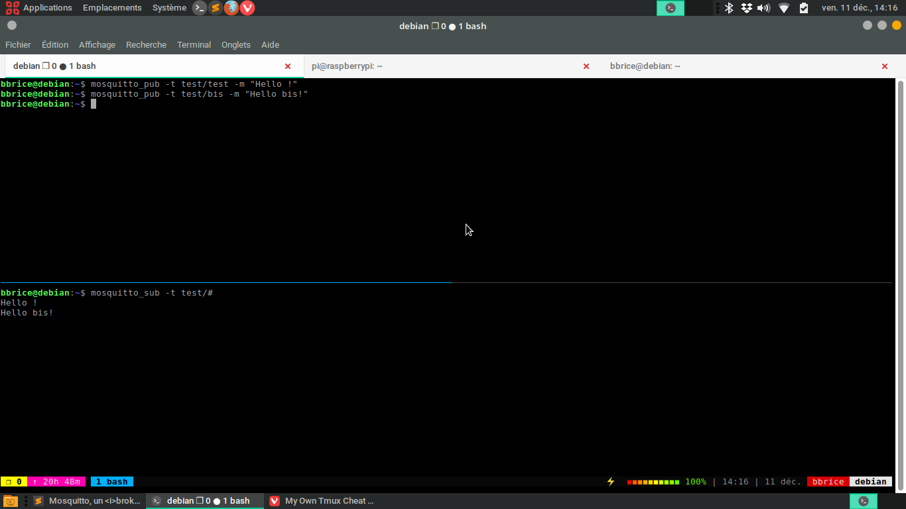

J'ai découvert le protocole MQTT (Message Queuing Telemetry Transport) lors de l'interfaçage de ma station météo Netatmo et du logiciel WeeWX sur mon Raspberry Pi&nbsp;; il s'agit d'un protocole de messagerie de type publication-abonnement, extrêmement rapide et léger, utilisé notamment dans l'internet des objets. 

Nous allons ici voir comment installer et configurer un _broker_, un agent MQTT, en l'occurrence [Mosquitto](https://mosquitto.org), en nous appuyant très largement sur [l'article «&nbsp;How to setup your own MQTT Broker&nbsp;» de Pat O'Brien](https://obrienlabs.net/how-to-setup-your-own-mqtt-broker/).

## Installation et premiers tests

On commence par l'installer&nbsp;:

```shell
sudo apt install mosquitto mosquitto-clients
```

Nous pouvons dès lors «&nbsp;jouer&nbsp;» un peu...     
On peut commencer par vérifier la version de notre agent ou le temps écoulé depuis son lancement&nbsp;:

```shell
mosquitto_sub -t \$SYS/broker/version
mosquitto_sub -t \$SYS/broker/uptime
```

Puis commencez par ouvrir deux sessions dans votre terminal (on ne saurait trop vous conseiller d'utiliser tmux, présenté [dans cet article](/blog/my-own-tmux-cheat-sheet))&ndash;: dans la première, on lance la commande `mosquitto_sub -t test/#` puis dans la seconde on lance `mosquitto_pub -t test/test -m "Test message"`...



## Configuration, accès, SSL

Il convient de préciser d'emblée que Mosquitto est très regardant sur le formatage de ses fichiers de configuration et qu'il n'accepte pas d'espace en fin de ligne.

On commence par éditer un fichier `/etc/mosquitto/conf.f/conf.d/myconfig.conf`&nbsp;:

```
persistence false

# mqtt
listener 1883
protocol mqtt

# websockets
listener 9001
protocol websockets
```

On redémarre alors Mosquitto&nbsp;:

```shell
sudo service mosquitto restart
```

## Gestion des accès

Mosquitto permet de gérer topic par topic les droits de publication et d'abonnement.

On commence par générer un couple identifiant / mot de passe, ainsi&nbsp;:

```shell
sudo mosquitto_passwd -c /etc/mosquitto/passwd USER
```

puis on édite un fichier `/etc/mosquitto/acl`

```
# Autoriser l'abonnement anonyme à $SYS
topic read $SYS/#

# Autoriser l'abonnement et la publication anonymes à test 
topic test/#

# Autoriser le seul abonnement anonyme à testlecture
topic read testlecture/#

# Accès limité pour l'écriture sur testlecture
# Abonnement et publication sur secret pour USER seulement
user USER
topic write testlecture
topic secret/#
```

on édite ensuite le fichier `/etc/mosquitto/conf.d/myconfig.conf` pour qu'il ressemble à cela&nbsp;:

```
persistence false
allow_anonymous true
password_file /etc/mosquitto/passwd
acl_file /etc/mosquitto/acl

# mqtt
listener 1883
protocol mqtt

# websockets
listener 9001
protocol websockets
```

On redémarre le service avant de vérifier avec la commande `netstat` que les ports déclarés sont bien ouverts&nbsp;:

```shell
$ sudo service mosquitto restart
$ sudo netstat -tulpn | grep 1883
tcp        0      0 0.0.0.0:1883            0.0.0.0:*               LISTEN      142015/mosquitto
tcp6       0      0 :::1883                 :::*                    LISTEN      142015/mosquitto
$ sudo netstat -tulpn | grep 9001
tcp6       0      0 :::9001                 :::*                    LISTEN      142015/mosquitto
```

Pour le canal _test_, accessible sans authentification ni pour l'abonnement ni pour la publication, on vérifie avec cette commande dans notre première session&nbsp;:

```shell
mosquitto_sub -h localhost -p 1883 -t test/#
```

et dans la seconde nous lançons&nbsp;:

```shell
mosquitto_pub -h localhost -p 1883 -t test/1 -m "Hello topic test/1"
```

Le canal _testlecture_ ne devrait être accessible anonymement qu'en lecture&nbsp;:

```shell
mosquitto_sub -h localhost -p 1883 -t testlecture/#
```

La première des deux commandes suivantes ne devrait rien renvoyer dans notre première session&nbsp;; il convient en effet de s'authentifier pour publier dans ce canal&nbsp;:

```shell
mosquitto_pub -t testlecture/test -m "test"
mosquitto_pub -u USER -P PASSWORD -t testlecture/test -m "test"
```

Enfin, le canal _secret_ nécessite de s'authentifier aussi bien pour l'abonnement que pour la publication&nbsp;:

```shell
mosquitto_sub -u USER -P PASSWORD -t secret/#
```

```shell
mosquitto_pub -u USER -P PASSWORD -t secret/test -m "test"
```

### Certificat SSL

Il est bien évidemment possible de rendre cet agent MQTT accessible sur Internet et de le configurer pour qu'il utilise une connexion sécurisée grâce à un certificat comme ceux proposés par Let's Encrypt. Nous allons considérer ici que vous avez déjà configuré votre nom de domaine et généré le certificat, [comme évoqué ici](/blog/auto-hebergement-dynhost-ovh-et-certificat-lets-encrypt-sous-raspbian).

Ainsi, dans mon cas, vous devriez pouvoir vous abonner au canal _weather_ produit par WeeWX et son plugin weewx-mqtt avec la commande suivante&nbsp;:

```shell
mosquitto_sub -h meteo.momh.fr -p 8883 --capath /etc/ssl/certs/ -t weather/#
```


Il convient, après avoir généré son certificat, d'éditer le fichier `/etc/mosquitto/conf.d/myconfig.conf` de la sorte&nbsp;:

```
# Insecure mqtt to localhost only, and secure mqtt
listener 1883 localhost
listener 8883
certfile /etc/letsencrypt/live/DOMAINE/cert.pem
cafile /etc/letsencrypt/live/DOMAINE/chain.pem
keyfile /etc/letsencrypt/live/DOMAINE/privkey.pem
protocol mqtt

# websockets
listener 9001
certfile /etc/letsencrypt/live/DOMAINE/cert.pem
cafile /etc/letsencrypt/live/DOMAINE/chain.pem
keyfile /etc/letsencrypt/live/DOMAINE/privkey.pem
protocol websockets
```

Après avoir redémarré le service

```shell
sudo service mosquitto restart
```

on peut tester ainsi, avec pour chacune de nos deux sessions, les commandes&nbsp;:

```shell
mosquitto_sub -h DOMAINE -p 8883 --capath /etc/ssl/certs/ -u USER -P PASSWORD -t secret/#
```

```shell
mosquitto_pub -h DOMAINE -p 8883 -u USER -P PASSWORD -t secret/test -m "Test message dans le canal secret"
```

Nous pouvons désormais utiliser notre agent MQTT avec WeeWX&nbsp;!