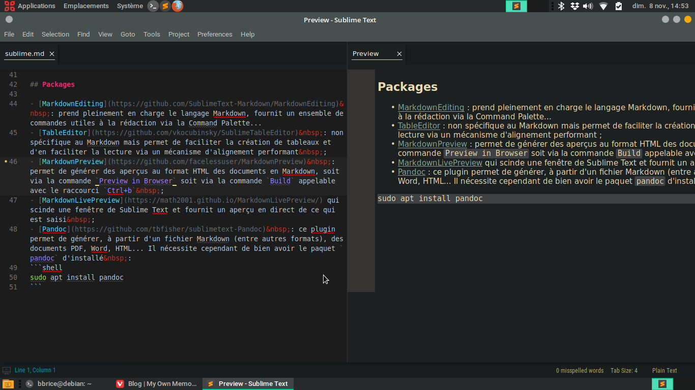

## Packages

- [MarkdownEditing](https://github.com/SublimeText-Markdown/MarkdownEditing)&nbsp;: prend pleinement en charge le langage Markdown, fournit un ensemble de commandes utiles à la rédaction via la Command Palette...
- [TableEditor](https://github.com/vkocubinsky/SublimeTableEditor)&nbsp;: non spécifique au Markdown mais permet de faciliter la création de tableaux et d'en faciliter la lecture via un mécanisme d'alignement performant&nbsp;;
- [MarkdownPreview](https://github.com/facelessuser/MarkdownPreview)&nbsp;: permet de générer des aperçus au format HTML des documents en Markdown, soit via la commande `Preview in Browser` soit via la commande `Build` appelable avec le raccourci `Ctrl+b`&nbsp;;
- [MarkdownLivePreview](https://math2001.github.io/MarkdownLivePreview/)&nbsp;: scinde une fenêtre de Sublime Text et fournit un aperçu en direct de ce qui est saisi.

- [Pandoc](https://github.com/tbfisher/sublimetext-Pandoc)&nbsp;: ce plugin permet de générer, à partir d'un fichier Markdown (entre autres formats), des documents PDF, Word, HTML... Il nécessite cependant de bien avoir le paquet `pandoc` d'installé&nbsp;:     
```shell
sudo apt install pandoc
```

## Snippets

- guillemets français en HTML&nbsp;:    
```xml
<snippet>
    <content><![CDATA[
«&#8239;${1}&#8239;»$0
]]></content>
    <!-- Optional: Set a tabTrigger to define how to trigger the snippet -->
    <tabTrigger>og</tabTrigger>
    <!-- Optional: Set a scope to limit where the snippet will trigger -->
    <scope>text.html.markdown,text.html</scope>
</snippet>
```
- espace insécable en HTML&nbsp;:      
```xml
<snippet>
    <content><![CDATA[
&nbsp;$0
]]></content>
    <!-- Optional: Set a tabTrigger to define how to trigger the snippet -->
    <tabTrigger>nbsp</tabTrigger>
    <!-- Optional: Set a scope to limit where the snippet will trigger -->
    <scope>text.html.markdown,text.html</scope>
</snippet>
```