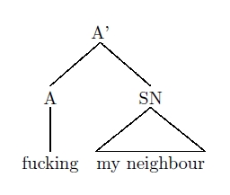
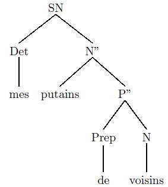
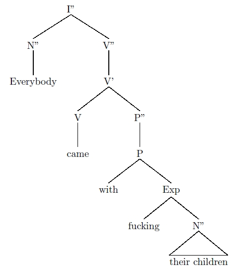

_synttree_, comme son nom le laisse présager, permet de créer, comme d'autres packages et outils (cf. [LaTeX4Ling](http://www.essex.ac.uk/linguistics/external/clmt/latex4ling/trees/)) des arbres syntaxiques. Pour le télécharger, rendez-vous [ici](http://www.matijs.net/software/synttree/).

===

Le package fourni l'instruction \synttree ; chaque élément de l'arbre vient s'imbriquer entre crochets. Mieux qu'un long discours, trois illustrations&nbsp;:

```latex
\synttree[A'
[A[fucking]]
[SN[.x my neighbour]]]
```

 

```latex
\synttree[SN
[Det[mes]]
[N''[putains]
[P''[Prep[de]][N[voisins]]]]]
```

 

```latex
\synttree[I''
[N'' [Everybody]]
[V''
[V'
[V [came]]
[P''
[P [with]
[Exp [fucking]
[N'' [.x their children]]
]]]]]]
```



Fichier d'exemple disponible [ici](synttree.tex).