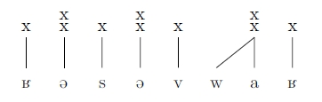
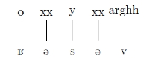
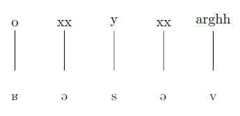
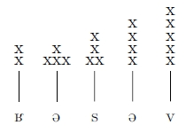

tikz/pgf permet de réaliser des graphiques d'une très grande complexité comme vous pouvez le constater en vous rendant sur [cette page](http://www.texample.net/tikz/examples/). Je me propose de donner ici un aperçu de l'utilisation – très basique – que j'en ai faite : générer des modèles et grilles rythmiques pour un dossier de phonologie.

Une fois que vous avez téléchargé ([ici](http://sourceforge.net/projects/pgf/)) et installé ce package, il vous suffit, pour l'utiliser, de l'appeler dans le préambule de votre document&nbsp;:

```latex
\usepackage{tikz,pgf}
```

N'hésitez pas à vous plonger dans la documentation – plus que conséquente (plus de 500 pages !) – pour trouver votre bonheur et pour vérifier les informations livrées ici (ça fait un moment que je n'ai pas utilisé la bête).

Avant de se lancer, mieux vaut avoir une idée précise de ce que l'on veut faire : en effet, la création du graphique passe par la déclaration de point, de coordonnées, et peut s'avérer longue et fastidieuse.

Voici un exemple de grille rythmique (utilisation du package [tipa](/blog/tipa_vowel))&nbsp;:

```latex
\newcommand{\sux}[1]{${\rm \stackrel{\textstyle x}{\raisebox{0ex}{#1}}}$}
  
\begin{tikzpicture}[black,scale=0.75]
  
  
 \draw (0,1.5) node[anchor=south] {x};
 \draw (1,1.5) node[anchor=south] {\sux{x}};
 \draw (2,1.5) node[anchor=south] {x};
 \draw (3,1.5) node[anchor=south] {\sux{x}};
 \draw (4,1.5) node[anchor=south] {x};
 \draw (6,1.5) node[anchor=south] {\sux{x}};
 \draw (7,1.5) node[anchor=south] {x};
  
 \foreach \x in {0,...,4} \draw (\x,1.5) [solid] -- (\x cm, 0.7cm);
\draw (5,0.7) -- (6,1.5);
 \foreach \x in {6,...,7} \draw (\x,1.5) [solid] -- (\x cm, 0.7cm);
  
 \draw (0,0) node[anchor=south] {\textipa{K}};
 \draw (1,0) node[anchor=south] {\textipa{@}};
 \draw (2,0) node[anchor=south] {\textipa{s}};
 \draw (3,0) node[anchor=south] {\textipa{@}};
 \draw (4,0) node[anchor=south] {\textipa{v}};
 \draw (5,0) node[anchor=south] {\textipa{w}};
 \draw (6,0) node[anchor=south] {\textipa{a}};
 \draw (7,0) node[anchor=south] {\textipa{K}};
  
\end{tikzpicture}
```



Tentons d'expliquer ce qui est fait dans ce code :

- dans un premier temps (lignes 18 à 25) nous « dessinons » la « ligne » de texte (correspondant ici à une transcription phonétique) : `draw (coordonnée x,coordonnée y) node[anchor=south}] {texte\_affiché}` place un point aux coordonnées x,y et le texte correspondant à ce point (ici un symbole API) est placé au-dessus du point (au-dessous si on utilise `[anchor=north]`)
- ensuite (lignes 6 à 12) nous dessinons la « ligne » de « croix » : même chose que précédemment si ce n'est que le texte est ici constitué de croix (lettre x) (quelques précisions plus bas)
- enfin nous traçons les traits nous permettant de relier les points de notre ligne de texte aux points de notre ligne de croix
  	- le plus simple : à la ligne 15, `\draw (5,0.7) -- (6,1.5);` permet de tracer un trait entre le point d'abscisse 5 et d'ordonnée 0.7 au point d'abscisse 6 et d'ordonnée 1.5. On obtient donc un tracé en diagonale ;
	- pour tracer un trait vertical on aurait alors `\draw (5,0.7) -- (5,1.5) ;`
	- il est possible d'automatiser les tracés, d'où les lignes 14 et 16.  
	Prenons la ligne 14 : `\foreach \x in {0,...,4} \draw (\x,1.5) [solid] -- (\x cm, 0.7cm);` : pour tout (`\foreach`) point d'abscisse (`\x`) entre 0 et 4 dessiner (`\draw`) de ce point au point d'abscisse identique et d'ordonnée 1.5 (`(\x,1.5)`) un trait plein (`[solid]`) ; cependant on précise que l'on part de l'ordonnée 0.7cm pour tout les points de départ (`(\x cm, 0.7cm)`) pour éviter que le trait ne recouvre le texte.

Demeurent deux questions : c'est quoi ce `\sux{x}` qui apparaît dans les lignes 7, 9 et 11 ? Et c'est quoi ce truc là, `\newcommand` ? En fait, dans la première ligne nous définissons la commande `\sur` que nous utilisons ensuite dans la définition du texte à « dessiner », pour faire en sorte que les les deux x soient placés verticalement et non pas horizontalement. Voici une petite démonstration&nbsp;:

```latex
\begin{tikzpicture}[black,scale=0.75]
 \draw (0,1.5) node[anchor=south] {o};
 \draw (1,1.5) node[anchor=south] {xx};
 \draw (2,1.5) node[anchor=south] {y};
 \draw (3,1.5) node[anchor=south] {xx};
 \draw (4,1.5) node[anchor=south] {arghh};
  
 \foreach \x in {0,...,4} \draw (\x,1.5) [solid] -- (\x cm, 0.7cm);
  
 \draw (0,0) node[anchor=south] {\textipa{K}};
 \draw (1,0) node[anchor=south] {\textipa{@}};
 \draw (2,0) node[anchor=south] {\textipa{s}};
 \draw (3,0) node[anchor=south] {\textipa{@}};
 \draw (4,0) node[anchor=south] {\textipa{v}};
\end{tikzpicture}
```



```latex
\begin{tikzpicture}[black,scale=1.25]
 \draw (0,1.5) node[anchor=south] {o};
 \draw (1,1.5) node[anchor=south] {xx};
 \draw (2,1.5) node[anchor=south] {y};
 \draw (3,1.5) node[anchor=south] {xx};
 \draw (4,1.5) node[anchor=south] {arghh};
  
 \foreach \x in {0,...,4} \draw (\x,1.5) [solid] -- (\x cm, 0.7cm);
  
 \draw (0,0) node[anchor=south] {\textipa{K}};
 \draw (1,0) node[anchor=south] {\textipa{@}};
 \draw (2,0) node[anchor=south] {\textipa{s}};
 \draw (3,0) node[anchor=south] {\textipa{@}};
 \draw (4,0) node[anchor=south] {\textipa{v}};
\end{tikzpicture}
```



```latex
\newcommand{\sux}[1]{${\rm \stackrel{\textstyle x}{\raisebox{0ex}{#1}}}$}
\newcommand{\suxx}[1]{${\rm \stackrel{\textstyle x}{\raisebox{0ex}{\sux{#1}}}}$}
\newcommand{\suxxx}[1]{${\rm \stackrel{\textstyle x}{\raisebox{0ex}{\suxx{#1}}}}$}
\newcommand{\suxxxx}[1]{${\rm \stackrel{\textstyle x}{\raisebox{0ex}{\suxxx{#1}}}}$}
  
\begin{tikzpicture}[black,scale=0.75]
 \draw (0,1.5) node[anchor=south] {\sux{x}};
 \draw (1,1.5) node[anchor=south] {\sux{xxx}};
 \draw (2,1.5) node[anchor=south] {\suxx{xx}};
 \draw (3,1.5) node[anchor=south] {\suxxx{x}};
 \draw (4,1.5) node[anchor=south] {\suxxxx{x}};
  
 \foreach \x in {0,...,4} \draw (\x,1.5) [solid] -- (\x cm, 0.7cm);
  
 \draw (0,0) node[anchor=south] {\textipa{K}};
 \draw (1,0) node[anchor=south] {\textipa{@}};
 \draw (2,0) node[anchor=south] {\textipa{s}};
 \draw (3,0) node[anchor=south] {\textipa{@}};
 \draw (4,0) node[anchor=south] {\textipa{v}};
\end{tikzpicture}
```



Dans le premier cas on constate que le texte attribué au point est dessiné horizontalement. Nous pouvons constater deux problèmes : problème d'alignement vertical lorsque les lettres utilisées ont des « jambes » et un problème de distance lorsque le texte est long. Ce second souci est résolu avec le second exemple où l'on joue sur l'échelle : lorsque l'on ouvre l'environnement _tikzpicture_ on peut lui passer des options (entre crochets) et notamment _scale_.

Dans le dernier cas, nous avons défini quatre commandes : `\sux`, `\suxx`, `\suxxx` et `\suxxxx` et avons montré les possibilités que cela permettait.
 

Vous trouverez le fichier avec ces exemples [ici](tikz.tex).