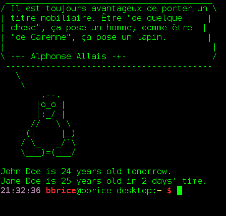

Bien que totalement inutile – donc totalement indispensable – votre terminal peut vous parler ou du moins afficher un air un peu moins triste lorsque vous le lancez...     
Je ne parle pas ici des possibilités de configuration de l'arrière-plan ou de la couleur du texte (entre autres) mais de quelque chose de plus surprenant, comme vous pouvez le voir ci-dessous.



Pour réaliser cela rien de bien compliqué : il suffit de deux petits programmes, _cowsay_ et _fortune_, et d'éditer le fichier `.bashrc`.

===

Le rappel des anniversaire est quant à lui géré par _birthday_ que nous avons présenté dans [un précédent article](/blog/birthday-ne-manquez-plus-danniversaires).

## Cowsay

Cowsay est un petit programme permettant, par défaut, d'afficher le dessin ASCII d'une vache avec un message (que l'on passe en argument).

Commençons par installer cowsay&nbsp;:

```bash
$ sudo apt install cowsay
```

Maintenant nous pouvons commencer à nous amuser un peu&nbsp;:

```bash
$ cowsay Salut&nbsp;!
```

nous donne un dessin ASCII d'une vache qui nous salue gentiment. Bien évidemment vous pouvez utiliser le texte que vous souhaitez comme argument à la commande cowsay. Une précision cependant&nbsp;: si votre texte est composé de plusieurs paragraphes (avec saut de ligne donc), il vous faudra protéger l'argument (le texte donc) avec des guillemets.

Mais cowsay ne se limite pas à une vache, comme vous avez pu le voir avec l'image ci-dessus. Comment donc ai-je obtenu ce pingouin ? Il suffit de faire un petit tour par le man de cowsay pour trouver notre bonheur&nbsp;:

>The -f option specifies a particular cow picture file ("cowfile") to use. If the cowfile spec contains '/' then it will be interpreted as a path relative to the current directory. Otherwise, cowsay will search the path specified in the COWPATH environment variable. To list all cowfiles on the current COWPATH, invoke cowsay with the -l switch.

On y apprend donc que la commande cowsay peut prendre un argument précisant le dessin que l'on souhaite parmi une liste que l'on connaît grâce à l'argument -l de la commande cowsay&nbsp;:   

```bash
$ cowsay -l
Cow files in /usr/share/cowsay/cows:
apt beavis.zen bong bud-frogs bunny calvin cheese cock cower daemon default
dragon dragon-and-cow duck elephant elephant-in-snake eyes flaming-sheep
ghostbusters gnu head-in hellokitty kiss kitty koala kosh luke-koala
mech-and-cow meow milk moofasa moose mutilated pony pony-smaller ren sheep
skeleton snowman sodomized-sheep stegosaurus stimpy suse three-eyes turkey
turtle tux unipony unipony-smaller vader vader-koala www
```

```bash
$ ls /usr/share/cowsay/cows/
apt.cow         cock.cow            elephant.cow           hellokitty.cow    meow.cow          ren.cow              suse.cow             vader.cow
beavis.zen.cow  cower.cow           elephant-in-snake.cow  kiss.cow          milk.cow          sheep.cow            three-eyes.cow       vader-koala.cow
bong.cow        daemon.cow          eyes.cow               kitty.cow         moofasa.cow       skeleton.cow         turkey.cow           www.cow
bud-frogs.cow   default.cow         flaming-sheep.cow      koala.cow         moose.cow         snowman.cow          turtle.cow
bunny.cow       dragon-and-cow.cow  ghostbusters.cow       kosh.cow          mutilated.cow     sodomized-sheep.cow  tux.cow
calvin.cow      dragon.cow          gnu.cow                luke-koala.cow    pony.cow          stegosaurus.cow      unipony.cow
cheese.cow      duck.cow            head-in.cow            mech-and-cow.cow  pony-smaller.cow  stimpy.cow           unipony-smaller.cow
```

Le résultat de la commande _cowsay -l_ n'étant pas forcément des plus clairs, nous avons dans un deuxième temps listé tous les éléments de /usr/share/cowsay/cows/ et nous obtenons quelque chose d'un peu plus lisible : nous avons donc ici l'ensemble des formes possibles possibles. À vous de choisir le dessin qui vous plaît le plus en utilisant la commande suivante et en remplaçant _skeleton.cow_ par le modèle que vous voulez&nbsp;:

```bash
$ cowsay -f skeleton.cow Salut&nbsp;!
```

Avant d'en finir avec cowsay, citons ici une dernière option (pour plus d'options et de détails consulter le man), celle permettant de gérer le nombre de colonnes (donc de caractères) par ligne de texte. Par défaut, le texte ne s'affiche que sur 40 colonnes, ce qui peut s'avérer un peu gênant dans le cas de longs discours&nbsp;; pour y remédier&nbsp;:

```bash
$ cowsay -W 60 -f tux.cow Lorem ipsum dolor sit amet, consectetur adipiscing elit.
```

## Fortune

Fortune est un programme simple affichant au hasard un message provenant d'une base de données. Ubuntu propose, outre le programme, une base de citations francophones. Installons tout cela&nbsp;:

```bash
$ sudo apt install fortune fortunes-fr
```

Pour afficher les citations, rien de plus simple&nbsp;:

```bash
$ fortune
```

Nous n'allons pas décrire les options de ce programme (tout est dans le man) mais seulement évoquer la possiblité de sélectionner la ou les bases de citations à utiliser. Pour connaître les fichiers disponibles, il vous faut lister les éléments se trouvant dans _/usr/share/games/fortunes-fr_ (pour les fichiers de citations anglo-saxonnes, il faut regarder dans le dossier _/usr/share/games/fortunes/_)&nbsp;:

```bash
$ ls /usr/share/games/fortunes-fr/
bd.dat         fr.rec.photo.dat  glp.dat         humour.dat                 litterature_francaise.dat  mysoginie.dat      politique.dat  tolkien_fr.dat
cinema.dat     gcu.dat           gpj.dat         informatique.dat           mauriceetpatapon.dat       oulipo.dat         proverbes.dat  tribune-linuxfr.dat
debian-fr.dat  GDP.dat           haiku.dat       linuxfr-undernet.dat       multidesk2.dat             personnalites.dat  religion.dat
droit.dat      gfa.dat           humoristes.dat  litterature_etrangere.dat  multidesk.dat              philosophie.dat    sciences.dat
```

Ensuite, il faut lancer la commande _fortune_ avec pour argument le nom du fichier (sans son extension)&nbsp;; il est même possible de spécifier plusieurs fichiers comme cela&nbsp;:

```bash
$ fortune bd humoristes humour
```

## Afficher une fortune avec cowsay...

Pour afficher une citation dans la bulle fournie par cowsay, il suffit de procéder ainsi&nbsp;:

```bash
$ fortune humoristes | cowsay
```

Sans oublier bien sûr les options de cowsay que nous avons vu précédemment&nbsp;; par exemple&nbsp;:

```bash
$ fortune bd humoristes humour | cowsay -W 80 -f tux.cow
```

## …à l'ouverture d'un terminal virtuel

Pour cela, il suffit d'éditer le fichier _~/.bashrc_

```bash
$ nano ~/.bashrc
```

et d'y ajouter la commande précédente (enfin celle que vous avez mitonnée). Et voilà, dès que vous ouvrez un terminal virtuel, vous êtes chaleureusement accueilli.