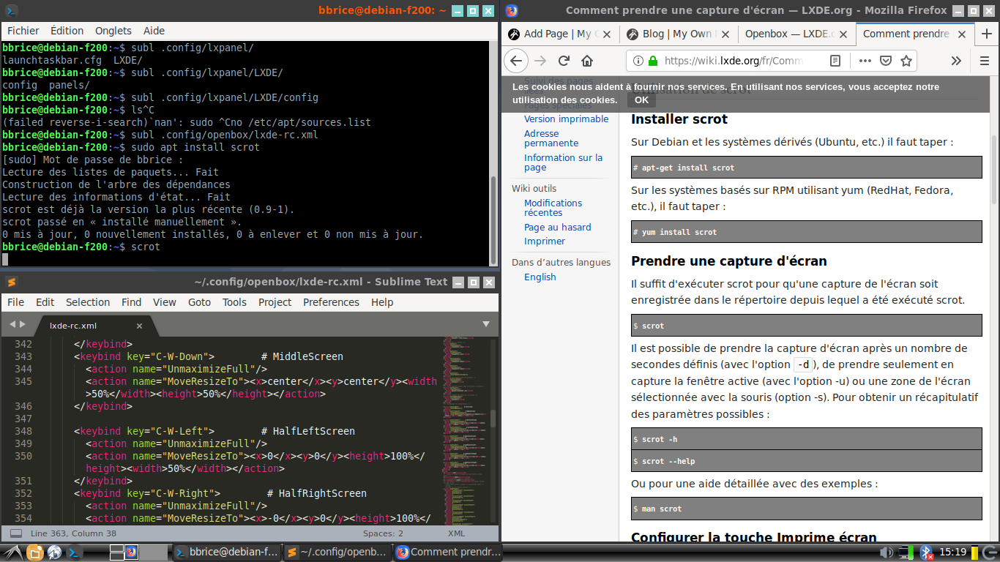

Il est particulièrement simple sous LXDE de configurer des raccourcis clavier permettant de redimensionner et de positionner les fenêtres, permettant ainsi d'afficher simultanément plusieurs applications.



Pour cela, il suffit d'éditer le fichier `~/.config/openbox/lxde-rc.xml` et d'ajouter dans la section `<keyboard>` ce qui suit&nbsp;:

```markup
	<keybind key="C-W-Up">        # FullScreen
      <action name="Maximize"/>
    </keybind>
    <keybind key="C-W-Down">        # MiddleScreen
      <action name="UnmaximizeFull"/>
      <action name="MoveResizeTo"><x>center</x><y>center</y><width>50%</width><height>50%</height></action>
    </keybind>

    <keybind key="C-W-Left">        # HalfLeftScreen
      <action name="UnmaximizeFull"/>
      <action name="MoveResizeTo"><x>0</x><y>0</y><height>100%</height><width>50%</width></action>
    </keybind>
    <keybind key="C-W-Right">        # HalfRightScreen
      <action name="UnmaximizeFull"/>
      <action name="MoveResizeTo"><x>-0</x><y>0</y><height>100%</height><width>50%</width></action>
    </keybind>

    <keybind key="C-W-1">        # UpperQuarterLeft
      <action name="UnmaximizeFull"/>
      <action name="MoveResizeTo"><x>0</x><y>0</y><height>50%</height><width>50%</width></action>
    </keybind>

    <keybind key="C-W-2">        # LowerQuarterLeft
      <action name="UnmaximizeFull"/>
      <action name="MoveResizeTo"><x>0</x><y>-0</y><height>50%</height><width>50%</width></action>
    </keybind>

    <keybind key="C-W-3">        # LowerQuarterRight
      <action name="UnmaximizeFull"/>
      <action name="MoveResizeTo"><x>-0</x><y>-0</y><height>50%</height><width>50%</width></action>
    </keybind>

    <keybind key="C-W-4">        # UpperQuarterRight
      <action name="UnmaximizeFull"/>
      <action name="MoveResizeTo"><x>-0</x><y>0</y><height>50%</height><width>50%</width></action>
    </keybind>
```